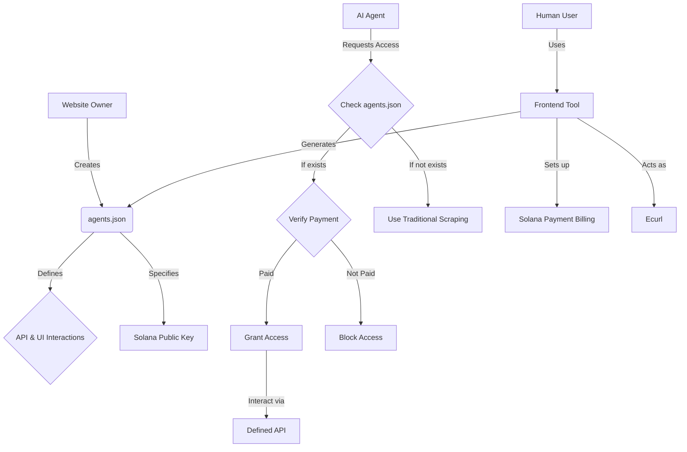

#README

Frontend:
Generate agents.json / interact with webpages

Backend:

Add agents.json to /agents.json our website reads the agents.json and uses that as a framework to interact with it. 
If not agents.json is found on a website, generate agent.json

Generate Agent.json:
Sign in with email and otp and then get solana address include that in the agent.json as well 

Either curl to get html 

Intereacting with agents.json:
tools:
click - 
type - 
navagate - 

